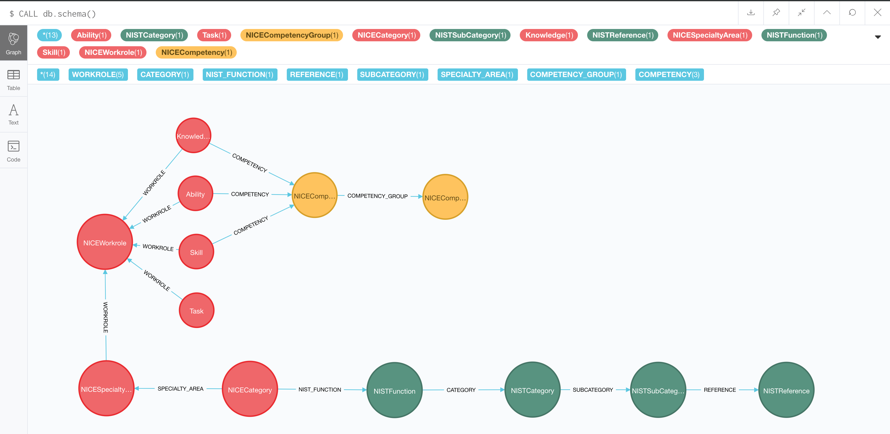

cwf2neo
=======

This repo contains the cwf2neo Python library used to parse and import the [NICE Cybersecurity Workforce Framework](https://www.nist.gov/itl/applied-cybersecurity/nice/resources/nice-cybersecurity-workforce-framework) into a [Neo4j](https://neo4j.com/) graph database, which can be used to run complex queries against.

Please see the online documentation at https://cwf2neo.readthedocs.io/.

----

